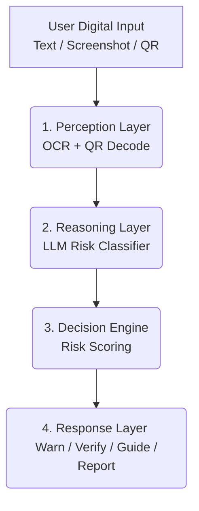

<div align="center">

# 🛡️ RakshaOS
**AI-Powered Digital Safety Layer for Ordinary People**

[](https://bharatacademix.com/)
[](https://opensource.org/licenses/MIT)
[](https://www.python.org/downloads/)
[](https://nextjs.org/)

</div>

> RakshaOS is an AI-powered digital safety layer that understands what a user is being *asked to do* — not just what they're receiving — and detects scams, fraud, manipulation, and risky digital actions before they cause financial or personal harm.

---

## 🚨 The Problem

Digital fraud is a national-scale crisis affecting the most vulnerable:
- Cyber fraud losses exceed **₹10,178 crore** in early 2026 alone, with less than 29% recovery.
- Scams like "Digital Arrest" have grown by 21x in just two years.
- Current tools (Truecaller, spam blockers) only filter known bad numbers/links. They don't evaluate the *psychological pattern* or the *requested action*.

**RakshaOS** helps ordinary people answer one critical question: *"Is what I'm being asked to do right now actually safe?"*

## 💡 Our Solution

RakshaOS intercepts suspicious digital inputs (messages, screenshots, QR codes) and passes them through an AI reasoning pipeline to determine risk.

Instead of a black-box "spam" or "not spam" label, RakshaOS provides:
1. **Risk Score** (Safe, Warning, High Risk, Emergency)
2. **"Why?"** (Plain-language reasons behind the verdict)
3. **Actionable Next Steps** (e.g., "Don't pay. Verify via the official helpline")

### 🧬 The "Scam Genome" Approach
By analyzing *behavioral signatures* (urgency + authority impersonation + payment request), RakshaOS identifies **new** and **mutated** scam variants rather than relying on stale blocklists.

---

## ✨ Features (MVP Scope)

- 💬 **Text/WhatsApp Analysis**: Paste messages to get an instant risk assessment.
- 🖼️ **Screenshot Scanning**: OCR-powered analysis of suspicious emails, fake payment receipts, or KYC warnings.
- 🔗 **QR Code Decoder**: safely extracts and checks URLs behind QR codes against heuristics.
- 🚑 **Recovery Mode**: An "I already paid" flow that generates a pre-filled complaint draft and evidence checklist to boost recovery rates.
- 🗣️ **Multilingual Support**: Simplified explanations designed for elderly and low-literacy users.

---

## 🏗️ Architecture



## 🛠️ Technology Stack

- **Frontend**: Next.js, React, TailwindCSS
- **Backend**: Python, FastAPI / Flask 
- **AI / Reasoning**: Google Gemma 4 E2B/E4B (Structured JSON Output via Few-Shot Prompting)
- **Perception**: Tesseract OCR (Image to Text), standard QR decoding
- **Integrations**: Telegram Bot API (for easy user interaction)

---

## 📂 Project Structure

- `frontend/` - Next.js based web dashboard and user interface.
- `backend/` - Python API for handling OCR, QR decoding, and LLM reasoning.
- `android-app/` & `android-monitor/` - Android specific implementations for on-device safety.
- `whatsapp-monitor/` - WhatsApp integration layer.

---

## 🚀 Getting Started

### Prerequisites
- Node.js (v18+)
- Python (3.9+)

### 1. Clone the repository
```bash
git clone https://github.com/your-username/RakshaOS.git
cd RakshaOS
```

### 2. Start the Platform (Recommended for Judges)
RakshaOS includes an automated startup script that handles all environment setup, dependency installation (frontend, backend & monitors), and service launching.

```bash
# Make the launcher executable
chmod +x start_rakshaos.sh

# Run the launcher
./start_rakshaos.sh
```

**What the script does automatically:**
1. Generates a `.env` file (you will need to paste your `GEMINI_API_KEY` and Telegram credentials into it).
2. Creates a Python virtual environment and installs backend dependencies.
3. Installs Node.js dependencies for both the Next.js frontend and WhatsApp monitor.
4. Boots up the FastAPI backend, Next.js Command Center, and ADB monitors in the background.

Once the script finishes booting all services, access the web application at `http://localhost:3000`.
To stop all services, simply press `Ctrl+C` in the terminal.

---

## 🔮 Future Roadmap (Beyond Hackathon)
- Live voice-call monitoring with deepfake detection.
- Bank and Telecom API integration for real-time transaction holds.
- **"Family Shield"**: Automatic notifications to a trusted relative when an elderly user faces a high-risk interaction.

---

## 🤝 Contributing
Contributions, issues, and feature requests are welcome!
Feel free to check [issues page](https://github.com/your-username/RakshaOS/issues).

## 📝 License
This project is [MIT](https://opensource.org/licenses/MIT) licensed.
